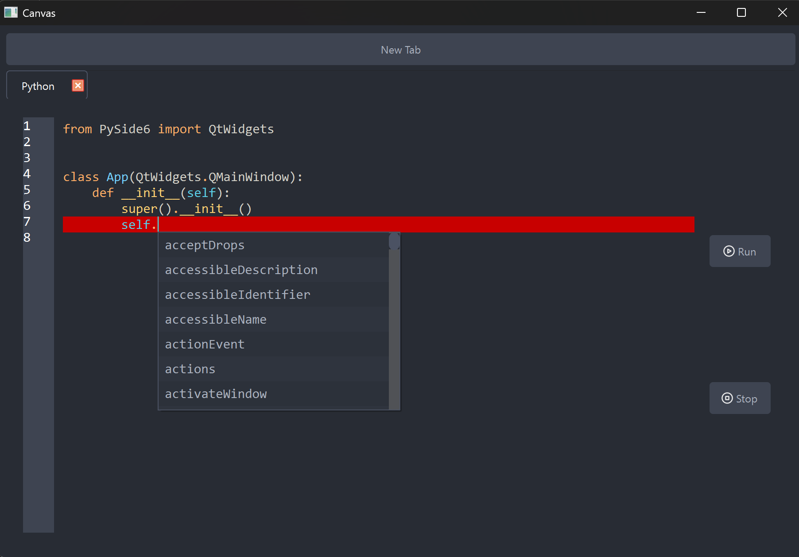

# Canvas


## A lightweight, streamlined Python IDE
Canvas is a fast, lightweight, streamlined Python IDE aimed for quick code prototyping and testing. Meant to replace the default Python IDLE, Canvas makes your life easier by removing all unnecessary steps in testing code snippets such as file creation.

## Installation
This repository use UV for project management. To setup the environment, clone or download the repository and run the following commands:

```
uv venv
uv sync
uv run main.py
```
## Features
Canvas is a lightweight, streamlined Python IDE. Here are some of its features:

- Code excecution without requiring file creation
- Linting
- Code syntax highlighting
- Code autocomplete
- And much more
